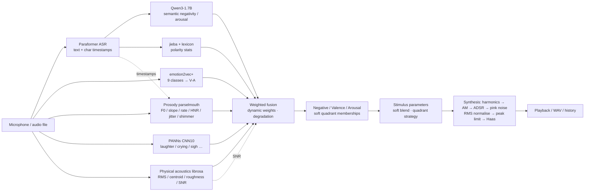

<div align="center">

# Mandarin-EmoStim

**A fully offline Mandarin speech emotion analysis and personalized acoustic-stimulus generation desktop research tool**

**English** | [中文](./README.md)

[](https://github.com/lijiawei255/mandarin-emo-stim/actions/workflows/ci.yml)
[](https://github.com/lijiawei255/mandarin-emo-stim/releases)
[](./LICENSE)
[](https://www.python.org/downloads/release/python-31014/)
[](#hardware-requirements-current-release-windows--nvidia-gpu)
[](https://github.com/astral-sh/ruff)
[](./CITATION.cff)

</div>

---

## Overview

Mandarin-EmoStim implements a complete local closed loop: **speak → quantify emotion → generate differentiated acoustic stimulus**.

With just a microphone, the tool:

1. Captures Mandarin speech;
2. Extracts features via 4 acoustic + 2 textual modalities (6 total) using pretrained models;
3. Performs weighted multi-feature fusion to produce interpretable, reproducible quantitative emotion metrics (Negative / Valence / Arousal / quadrant);
4. Generates **differentiated** personalized audible acoustic stimuli (WAV / real-time playback) according to Russell's circumplex model.

> ⚠️ This tool is for research exploration only and does not constitute medical advice or treatment. Vulnerable groups (history of epilepsy, severe heart disease, major depression under active treatment) should use it under professional guidance.

<p align="center">
  
</p>

## Features

- **Fully offline**: Once all models and runtime data are downloaded, no network connection is required.
- **Multi-modal fusion**: Acoustic emotion (emotion2vec), prosody (parselmouth), paralinguistic events (PANNs), physical acoustics (librosa), text semantics (Qwen3), text statistics (jieba).
- **Differentiated stimuli**: Continuous acoustic-parameter mapping from four-quadrant anchors, soft-blended to avoid abrupt hard switching.
- **Warm-ivory GUI**: PySide6 + pyqtgraph, ivory background with a single terracotta accent; every colour comes from `src/gui/theme.py`, text contrast chosen to WCAG AA, layout verified by a 3-resolution × 3-state geometry check.
- **Green & portable**: All data stays under `portable_data/` in the project directory; deleting the folder removes everything.
- **License-compliant**: Apache License 2.0, compatible with all upstream models and dependencies.

## Hardware requirements (current release: Windows + NVIDIA GPU)

| Item | Minimum | Recommended |
|------|---------|-------------|
| GPU | 6GB VRAM NVIDIA (CUDA) | 8GB+ VRAM |
| RAM | 8GB | 16GB |
| OS | Windows 10/11 | Windows 11 |

> This release is only tested on **Windows with an NVIDIA GPU**. CPU-only mode and Apple Silicon code paths are designed but not validated in this version.

## Quick start

### 1. Create the environment

```bash
conda create -n mandarin-emo-stim python=3.10.14 -y
conda activate mandarin-emo-stim
```

### 2. Install dependencies

> Python **must** be 3.10.x (3.11/3.12 may break bitsandbytes compatibility).

```bash
# PyTorch (NVIDIA / CUDA 12.1)
pip install torch==2.3.1 torchaudio==2.3.1 --index-url https://download.pytorch.org/whl/cu121

# Remaining dependencies
pip install -r requirements.txt
```

**Windows prerequisites**: [ffmpeg](https://ffmpeg.org/download.html) (on PATH); if scipy/parselmouth fail to build, install [Microsoft Visual C++ Build Tools](https://visualstudio.microsoft.com/visual-cpp-build-tools/) (check "Desktop development with C++").

### 3. First run

```bash
python main.py
```

On first launch: hardware detection → check & download models (~6GB) → load → ready.

## Headless run (no GUI)

```bash
python -m src.stimulus.cli --audio path/to/test.wav
```

See `docs/developer_guide.md` for details.

## Acoustic safety

- Generated audio is **digitally peak-limited** to -10 dBFS and RMS-normalised to [-30, -10] dBFS. **dBFS is relative to digital full scale; the actual sound-pressure level depends entirely on your playback device and system volume, and this software cannot guarantee any SPL.**
- Start at a low volume and increase gradually; if you need strict SPL control, calibrate the playback chain with a sound-level meter.
- Headphones are recommended for the best experience (optional; speakers are also safe).

## Algorithm overview

The closed loop is grounded in **psychology + multimodal affective computing**:

1. **Emotion quantification** uses Russell's circumplex model (Valence × Arousal plane).
   Six modalities (acoustic emotion / prosody / paralinguistic / physical / text-LLM /
   text-stats) are fused with weighted averaging, where the weights **adapt dynamically**
   to signal quality (SNR / ASR confidence) for robustness to noise, accents, and ASR errors.
2. **Differentiated stimuli** are generated per emotion quadrant based on empirical
   music-psychology mappings — e.g. slow pulses to pace breathing for anxious Q2, bright
   consonant tones to energize depressed Q3. Parameters are continuous and soft-blended
   across quadrants to avoid abrupt transitions.



Full algorithm derivations, per-modality rationale, parameter mappings, evidence levels and
references are in **[docs/research_notes.md](./docs/research_notes.md)** (in Chinese). Each
module's docstring also has a concise explanation.

## Validation status

The methodology has **not** been validated on naturalistic emotional speech. What has been
validated, and its limits, is summarised below; full results are in
**[docs/evaluation.md](./docs/evaluation.md)** and the evidence level of every method is
annotated in **[docs/research_notes.md](./docs/research_notes.md)** (Chinese).

| Tier | Corpus (licence) | What is checked | Status |
|------|------------------|-----------------|--------|
| 1 | AISHELL-3 (Apache-2.0, emotion-neutral read speech) | Measured prosodic z-score norms replacing hand-set constants; Paraformer CER; whether neutral speech maps to the centre | done |
| 2 | CSEMOTIONS (Apache-2.0, acted emotions by professional voice actors) | V-A direction consistency across 7 emotions, quadrant confusion matrix, 6-modality ablation, dynamic-weight on/off | done |
| 3 | Synthetic controlled signals (no external data) | Response direction of every module to F0 / rate / HNR / roughness manipulations; intervention-branch direction; continuity across quadrants | in CI |

**v0.1.0 headline results** (see evaluation.md): relative V-A ordering of 7 acted emotions passes 8/8 pairwise checks (valence Spearman ρ = 0.69, arousal 0.32);
quadrant accuracy 0.52 (chance 0.25, majority 0.41); **a systematic negative bias exists** (62% of emotion-neutral read speech lands in Q3);
**multimodal fusion did not beat emotion2vec alone on this corpus** (0.52 vs 0.55) and dropping the LLM text branch raises it to 0.62; dynamic weights never triggered under studio conditions.

Known limits: acted emotion is exaggerated relative to natural emotion and **overestimates**
real-world performance; studio-quality audio cannot exercise the noise-robustness rules; the ASR
confidence is a text-length proxy; fusion weights and V-A anchors are heuristic, not learned.

Reproduce: `pip install -r requirements-eval.txt`, then `python scripts/evaluate.py calibrate | neutral | emotion | report`
(evaluation data is downloaded on demand into `portable_data/eval/`; the repository ships no audio).

## License

[Apache License 2.0](./LICENSE). Compatible with all upstream models and dependencies.

## Acknowledgements

This project builds on: emotion2vec, Paraformer (FunASR), PANNs, Qwen3, praat-parselmouth, librosa, slab, jieba, PySide6, pyqtgraph, and more. Full references are in `docs/research_notes.md`.
