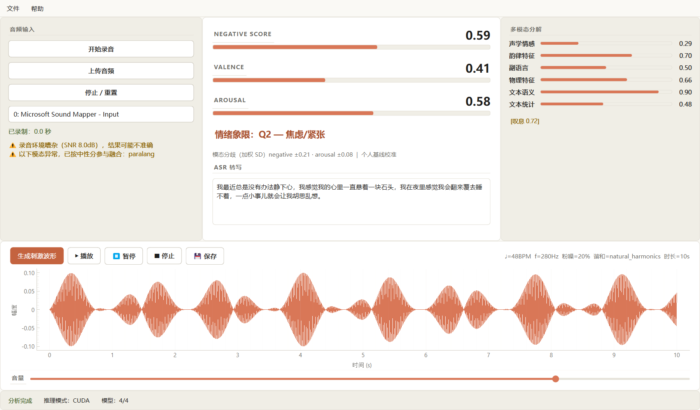
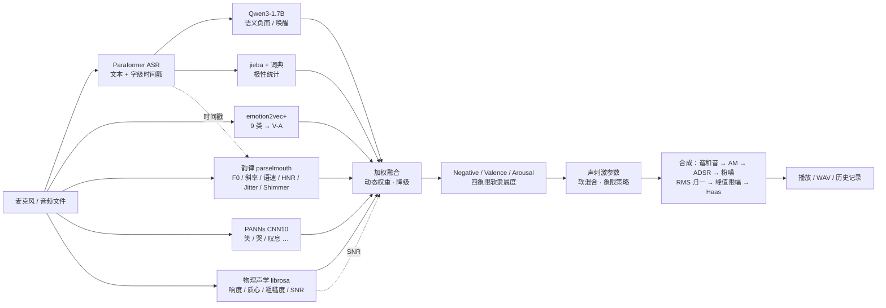

<div align="center">

# Mandarin-EmoStim

**全离线中文普通话语音情感分析与个性化声刺激生成桌面科研工具**

[English](./README.en.md) | **中文**

[](https://github.com/lijiawei255/mandarin-emo-stim/actions/workflows/ci.yml)
[](https://github.com/lijiawei255/mandarin-emo-stim/releases)
[](./LICENSE)
[](https://www.python.org/downloads/release/python-31014/)
[](#硬件要求当前版本windows--nvidia-gpu)
[](https://github.com/astral-sh/ruff)
[](./CITATION.cff)

</div>

---

## 简介

Mandarin-EmoStim 实现了一条完整的本地闭环：**说话 → 情绪量化 → 差异化声刺激**。

只需一个麦克风，工具会：

1. 采集中文普通话语音；
2. 通过 4 条声学支路 + 2 条文本支路（共 6 模态）的预训练模型提取特征；
3. 多特征加权融合，输出可解释、可复现的量化情绪指标（Negative / Valence / Arousal / 情绪象限）；
4. 依据 Russell 情绪环模型，生成**差异化**的个性化可听声刺激（WAV / 实时播放）。

> ⚠️ 本工具为科研探索用途，不构成医疗建议或治疗手段。特殊人群（癫痫史、严重心脏病、重度抑郁症正在接受治疗者）建议在专业人员指导下使用。

<p align="center">
  
</p>

## 特性

- **全离线**：所有模型与运行时数据下载完成后无需任何网络连接。
- **多模态融合**：声学情感（emotion2vec）、韵律学（parselmouth）、副语言事件（PANNs）、物理声学（librosa）、文本语义（Qwen3）、文本统计（jieba）。
- **差异化声刺激**：基于四象限锚点的连续声学参数映射，软混合避免硬切换突兀。
- **暖奶油色 GUI**：PySide6 + pyqtgraph，ivory 底色 + 单一陶土橙强调色，全部色值来自 `src/gui/theme.py`，文字对比度按 WCAG AA 选定；布局经 3 分辨率 × 3 状态几何检查。
- **绿色便携**：所有数据集中在项目目录下的 `portable_data/`，删除即清除，不污染系统。
- **开源合规**：Apache License 2.0，与全部上游模型/依赖协议兼容。

## 硬件要求（当前版本：Windows + NVIDIA GPU）

| 项目 | 最低 | 推荐 |
|------|------|------|
| 显卡 | 6GB 显存 NVIDIA（CUDA） | 8GB+ 显存 |
| 内存 | 8GB | 16GB |
| 系统 | Windows 10/11 | Windows 11 |

> 当前版本仅针对 **Windows + NVIDIA 显卡**测试通过。纯 CPU 模式与 Apple Silicon 的代码路径已设计，但未在本版本验证。

## 快速开始

### 1. 创建环境

```bash
conda create -n mandarin-emo-stim python=3.10.14 -y
conda activate mandarin-emo-stim
```

### 2. 安装依赖

> Python **必须** 3.10.x（3.11/3.12 可能与 bitsandbytes 不兼容）。

```bash
# PyTorch（NVIDIA / CUDA 12.1）
pip install torch==2.3.1 torchaudio==2.3.1 --index-url https://download.pytorch.org/whl/cu121

# 其余依赖
pip install -r requirements.txt
```

**Windows 前置**：需要 [ffmpeg](https://ffmpeg.org/download.html)（加入 PATH）；若 scipy/parselmouth 编译失败，安装 [Microsoft Visual C++ Build Tools](https://visualstudio.microsoft.com/visual-cpp-build-tools/)（勾选 "Desktop development with C++"）。

**国内用户**建议配置 pip 镜像加速：
```bash
pip config set global.index-url https://pypi.tuna.tsinghua.edu.cn/simple
```

### 3. 首次运行

```bash
python main.py
```

首次启动会：硬件检测 → 检查并下载模型（约 6GB）→ 加载 → 进入就绪状态。

> 国内网络环境下，模型自动从国内源下载（Paraformer/emotion2vec 走 ModelScope，Qwen3 走 hf-mirror.com，PANNs 走 Zenodo）。

## 无头运行（不启动 GUI）

```bash
python -m src.stimulus.cli --audio path/to/test.wav
```

详见开发者文档 `docs/developer_guide.md`。

## 算法原理（简述）

核心闭环基于**心理学 + 多模态情感计算**：

1. **情绪量化**：用 Russell 情绪环模型（Valence × Arousal 二维平面），通过 6 模态
   （声学情感/韵律/副语言/物理声学/文本语义/文本统计）加权融合得到连续情绪坐标。
   融合权重按信号质量（SNR / ASR 置信度）**动态自适应**，对噪声/口音/ASR 错误鲁棒。
2. **差异化声刺激**：依据音乐心理学实证映射，按情绪象限生成不同参数的声刺激——
   如 Q2 焦虑用慢脉冲引导呼吸放缓、Q3 抑郁用明亮协和音注入能量。声学参数连续映射
   + 四象限软混合，避免硬切换突兀。



完整的算法推导、各模态原理、参数映射依据、证据等级与参考文献见
**[docs/research_notes.md](./docs/research_notes.md)**。各模块 docstring 也有精炼说明。

## 验证状态

本仓库的方法学**未经自然情绪语料验证**。已完成的验证与其边界如下，完整结果见
**[docs/evaluation.md](./docs/evaluation.md)**，每处方法学的证据等级见
**[docs/research_notes.md](./docs/research_notes.md)**。

| 层 | 语料（许可） | 验证什么 | 状态 |
|----|------------|---------|------|
| 1 | AISHELL-3（Apache-2.0，情绪中性朗读） | 韵律 z-score 基准 μ/σ 实测替换凭空常数；Paraformer 字错率；中性语音上的输出是否居中 | 已完成 |
| 2 | CSEMOTIONS（Apache-2.0，专业配音员表演型情绪） | 7 类情绪的 V-A 方向一致性、象限混淆矩阵、6 模态消融、动态权重开关 | 已完成 |
| 3 | 合成受控信号（无外部数据） | 各模块对 F0 / 语速 / HNR / 粗糙度操控的响应方向；干预分支方向；跨象限连续性 | 进 CI |

**v0.4.0 结果摘要**（详见 evaluation.md §0.0–§0.1，含历次对照）：正式数字为**性别均衡的 5 折说话人交叉验证**。
默认配置象限准确率 0.67 ± 0.08（随机 0.25，多数类 0.41），效价 Spearman ρ 0.80，唤醒 0.34；7 类情绪 V-A 相对排序 8/8 通过。
**用受试者自己的平静朗读做基线**（可预存的受试者档案）折间标准差降到 0.014、效价 ρ 0.82，是最稳的配置；可选的岭回归融合准确率 0.715。
ASR 置信度改为 Paraformer token 后验均值，与逐句字错率呈负相关（ρ ≈ −0.32）。可信度等级按各分歧档的实测准确率给出，实测发现**模态一致并不代表可信**。
**唤醒度判别仍弱**；动态权重在录音棚条件下极少触发。

已知边界：表演型情绪比自然情绪夸张，会**高估**真实表现；录音棚音质无法检验噪声鲁棒性；
ASR 置信度为文本长度代理指标；融合权重与 V-A 锚点为启发式，未经学习。

复跑：`pip install -r requirements-eval.txt` 后依次 `python scripts/evaluate.py calibrate | neutral | emotion | report`
（评测数据运行时按需下载到 `portable_data/eval/`，仓库不分发任何音频）。


## 项目结构

```
mandarin-emo-stim/
├── config/            # 配置文件（融合权重、情绪映射、刺激参数）
├── src/
│   ├── audio/         # 录音/加载/VAD
│   ├── models/        # 4 个预训练模型封装 + 下载器 + 管理器
│   ├── features/      # 韵律/物理/文本统计特征
│   ├── fusion/        # 归一化 + 加权融合 + 象限判定
│   ├── stimulus/      # 声刺激参数映射 + 合成 + 播放
│   ├── storage/       # SQLite 历史记录 + 导出
│   └── gui/           # 暖奶油主题界面（theme.py 为唯一调色板）
├── resources/         # 字体/图标/情感词表
├── scripts/           # 模型预下载 / 评测 / 截图 / 布局检查
├── tests/             # pytest（单元 · 科学行为 · GUI 冒烟 · 布局几何 · GPU）
├── docs/              # 文档（research_notes · evaluation · 用户/开发者手册 · 界面截图）
└── portable_data/     # 运行时生成，gitignore 排除（模型/录音/日志）
```

## 声音安全声明

- 生成音频的**数字峰值限幅**为 -10 dBFS，响度按 RMS 归一到 [-30, -10] dBFS。**dBFS 是数字满刻度相对值，实际声压级取决于你的播放设备与系统音量，本软件无法保证任何 SPL 数值。**
- 请从低音量起听并逐步调到舒适水平；如需严格的声压控制，请用声级计对播放链路做校准。
- 建议使用耳机以获得最佳体验（非必须，扬声器同样安全）。

## 开源协议

[Apache License 2.0](./LICENSE)。所有上游模型与依赖协议兼容。

## 致谢

本项目使用了以下开源成果：emotion2vec、Paraformer（FunASR）、PANNs、Qwen3、praat-parselmouth、librosa、slab、jieba、PySide6、pyqtgraph 等。详细参考文献见 `docs/research_notes.md`。
